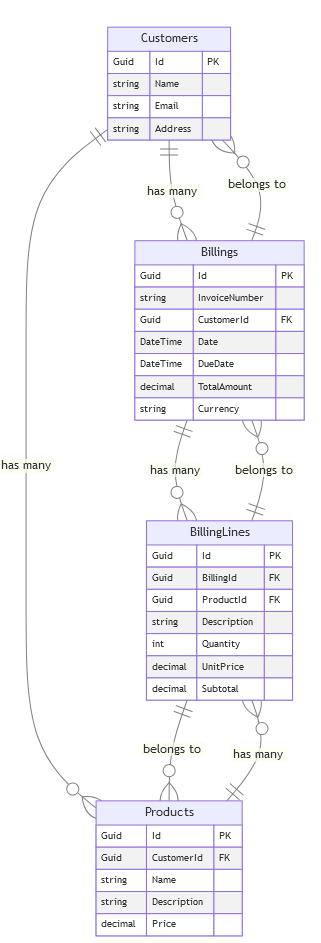

# ca-backend-test

## Visão Geral

Documentação da API ca-backend-test. Esta API é projetada para gerenciar operações de faturamento de clientes. Abaixo, você encontrará informações detalhadas sobre as tecnologias utilizadas, como configurar o projeto e detalhes de cada endpoint disponível.

Link da aplicação hospedado no plano Gratuito do Azure
https://ca-backend-test-axdjabe2fthbcgfn.brazilsouth-01.azurewebsites.net//index.html

## Tecnologias Utilizadas

- **.NET Core 8**
- **Entity Framework**
- **FluentValidation**
- **Manipulador de Notificações**: Usado para manipular notificações em vez de exceções quando não for realmente uma exceção.
- **Swagger**


## Endpoints da API

### /api/billings/importBillingToLocalDb (POST)
- Importa dados de faturamento a partir de APIs externas para o banco de dados local.

### /api/billings (GET)
- Retorna uma lista de todos os faturamentos.

### /api/customers (GET, POST)
- GET: Retorna uma lista de todos os clientes.
- POST: Cria um novo cliente.

### /api/customers/{id} (GET, PUT, DELETE)
- GET: Retorna os detalhes de um cliente específico.
- PUT: Atualiza os detalhes de um cliente específico.
- DELETE: Remove um cliente específico.

### /api/products (GET, POST)
- GET: Retorna uma lista de todos os produtos.
- POST: Cria um novo produto.

### /api/products/{id} (GET, PUT, DELETE)
- GET: Retorna os detalhes de um produto específico.
- PUT: Atualiza os detalhes de um produto específico.
- DELETE: Remove um produto específico.

## Relacionamentos EF


## Executando o Projeto

### Ajustar a ConnectionString do Banco de Dados localmente

### Configurar o seu projeto para usar segredos de usuário

1. **Verifique se a ferramenta de segredos de usuário está instalada**:

    No terminal, execute o comando:
    ```shell
    dotnet user-secrets -h
    ```

    Se a ferramenta estiver instalada, você verá a ajuda com os comandos disponíveis. Caso contrário, você precisará instalar o SDK do .NET Core.

2. **Inicialize os segredos de usuário no seu projeto**:

    Navegue até a raiz do seu projeto no terminal e inicialize os segredos de usuário:
    ```shell
    dotnet user-secrets init
    ```

3. **Adicione um segredo de usuário**:

    No terminal, adicione o segredo de usuário. No seu caso, a chave é `SECRETPASSWORD` e o valor será a senha que você deseja usar:
    ```shell
    dotnet user-secrets set "SECRETPASSWORD" "Cas2921!"
    ```

Ou altere diretamente a senha na connection String.
Caso utilize um novo banco de dados, execute Add-Migration.

### Executando a API

Após ajustar a senha do banco de dados, execute o projeto da camada de API, que o Index do Swagger abrirá automaticamente. Faça as chamadas das requisições conforme necessário.

## Funcionamento

### Endpoint /api/billings/importBillingToLocalDb

Este endpoint importa dados a partir de APIs externas para popular as tabelas Billings e BillingLines no banco de dados. 

#### Parâmetros
- **customerId**: Identificador do cliente (UUID).

### Exemplos de Uso

1. **Inclusão no banco de dados**: Primeiro cliente e produto da API externa Billing.
   

2. **Validação e Importação de Dados**:
   *Validação informada*: Disparo de notificação
   
   *Criação do produto faltante*
   
   *Importação realizada com sucesso*: 
   

3. **Listagem de Faturas**: 
   

---
